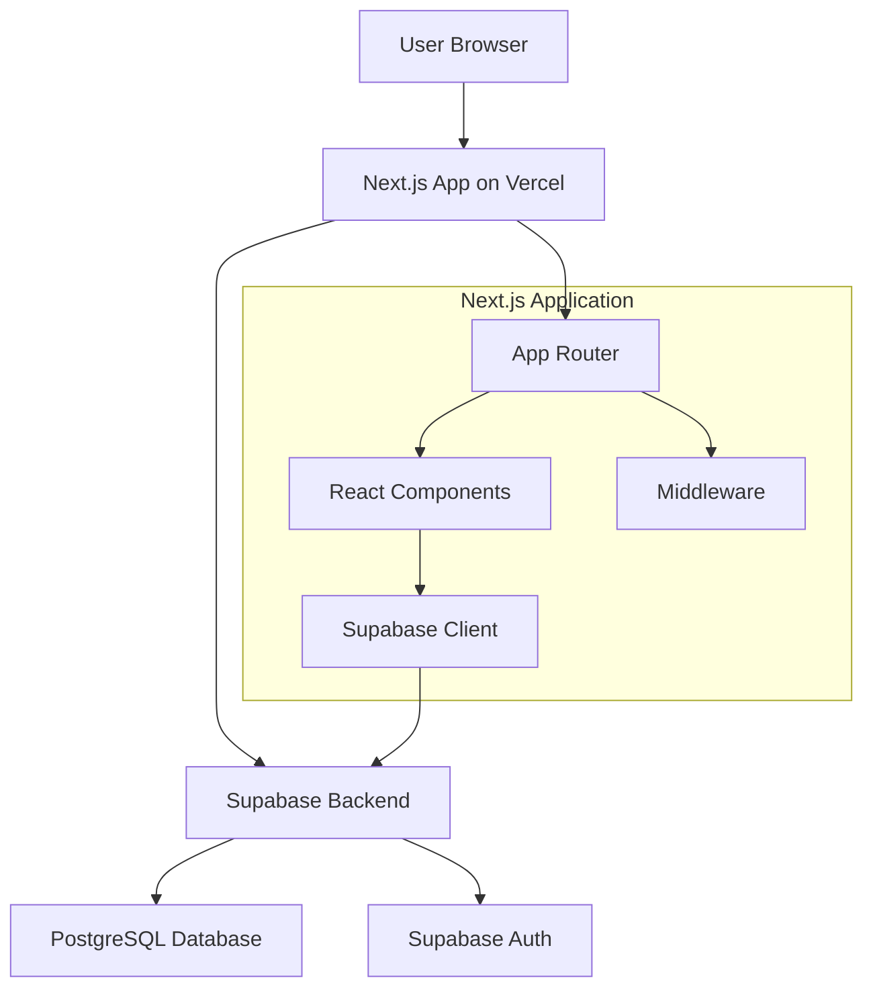

# Design Document

## Overview

Supabase学習用のTodoアプリケーションは、Next.js 14のApp Routerを使用したモダンなWebアプリケーションです。Supabaseをバックエンドとして使用し、認証、データベース操作、リアルタイム機能を学習できる構成になっています。アプリケーションはVercelにデプロイされ、レスポンシブデザインでモバイルからデスクトップまで対応します。

## Architecture

### システム構成図



### 技術スタック

- **フロントエンド**: Next.js 14 (App Router)
- **スタイリング**: Tailwind CSS
- **バックエンド**: Supabase
- **データベース**: PostgreSQL (Supabase管理)
- **認証**: Supabase Auth
- **デプロイ**: Vercel
- **状態管理**: React Hooks (useState, useEffect, useContext)

## Components and Interfaces

### ページ構成

```
app/
├── layout.tsx                 # ルートレイアウト
├── page.tsx                   # ホームページ（認証状態に応じてリダイレクト）
├── login/
│   └── page.tsx              # ログインページ
├── signup/
│   └── page.tsx              # サインアップページ
├── todos/
│   └── page.tsx              # Todoリストページ（認証必須）
└── globals.css               # グローバルスタイル
```

### コンポーネント構成

```
components/
├── auth/
│   ├── LoginForm.tsx         # ログインフォーム
│   ├── SignupForm.tsx        # サインアップフォーム
│   └── AuthButton.tsx        # ログアウトボタン
├── todos/
│   ├── TodoList.tsx          # Todoリスト表示
│   ├── TodoItem.tsx          # 個別Todoアイテム
│   ├── AddTodoForm.tsx       # Todo追加フォーム
│   └── DeleteConfirmModal.tsx # 削除確認モーダル
├── ui/
│   ├── Button.tsx            # 再利用可能ボタン
│   ├── Input.tsx             # 再利用可能入力フィールド
│   └── Modal.tsx             # 再利用可能モーダル
└── layout/
    ├── Header.tsx            # ヘッダーコンポーネント
    └── Navigation.tsx        # ナビゲーション
```

### Supabase設定

```
lib/
├── supabase/
│   ├── client.ts             # Supabaseクライアント設定
│   ├── auth.ts               # 認証関連ユーティリティ
│   └── database.types.ts     # データベース型定義
└── utils/
    └── auth-helpers.ts       # 認証ヘルパー関数
```

## Data Models

### データベーススキーマ

#### users テーブル（Supabase Auth自動生成）
```sql
-- Supabase Authが自動的に管理
-- auth.users テーブルを参照
```

#### todos テーブル
```sql
CREATE TABLE todos (
  id UUID DEFAULT gen_random_uuid() PRIMARY KEY,
  user_id UUID REFERENCES auth.users(id) ON DELETE CASCADE,
  title TEXT NOT NULL,
  completed BOOLEAN DEFAULT FALSE,
  created_at TIMESTAMP WITH TIME ZONE DEFAULT NOW(),
  updated_at TIMESTAMP WITH TIME ZONE DEFAULT NOW()
);

-- Row Level Security (RLS) ポリシー
ALTER TABLE todos ENABLE ROW LEVEL SECURITY;

-- ユーザーは自分のTodoのみアクセス可能
CREATE POLICY "Users can view own todos" ON todos
  FOR SELECT USING (auth.uid() = user_id);

CREATE POLICY "Users can insert own todos" ON todos
  FOR INSERT WITH CHECK (auth.uid() = user_id);

CREATE POLICY "Users can update own todos" ON todos
  FOR UPDATE USING (auth.uid() = user_id);

CREATE POLICY "Users can delete own todos" ON todos
  FOR DELETE USING (auth.uid() = user_id);
```

### TypeScript型定義

```typescript
// lib/supabase/database.types.ts
export interface Database {
  public: {
    Tables: {
      todos: {
        Row: {
          id: string
          user_id: string
          title: string
          completed: boolean
          created_at: string
          updated_at: string
        }
        Insert: {
          id?: string
          user_id: string
          title: string
          completed?: boolean
          created_at?: string
          updated_at?: string
        }
        Update: {
          id?: string
          user_id?: string
          title?: string
          completed?: boolean
          updated_at?: string
        }
      }
    }
  }
}

export type Todo = Database['public']['Tables']['todos']['Row']
export type NewTodo = Database['public']['Tables']['todos']['Insert']
export type UpdateTodo = Database['public']['Tables']['todos']['Update']
```

## Error Handling

### 認証エラー処理
- 無効な認証情報: ユーザーフレンドリーなエラーメッセージ表示
- セッション期限切れ: 自動的にログインページにリダイレクト
- ネットワークエラー: 再試行オプション付きエラー表示

### データベース操作エラー処理
- 接続エラー: 「サーバーに接続できません」メッセージ
- 権限エラー: 「アクセス権限がありません」メッセージ
- バリデーションエラー: フィールド固有のエラーメッセージ

### エラー境界実装
```typescript
// components/ErrorBoundary.tsx
class ErrorBoundary extends React.Component {
  // エラーキャッチとフォールバックUI表示
}
```

## Testing Strategy

### 単体テスト
- **フレームワーク**: Jest + React Testing Library
- **対象**:
  - コンポーネントの描画テスト
  - ユーザーインタラクションテスト
  - ユーティリティ関数テスト

### 統合テスト
- **フレームワーク**: Playwright
- **対象**:
  - 認証フロー（サインアップ、ログイン、ログアウト）
  - Todo CRUD操作
  - ページ間ナビゲーション

### E2Eテスト
- **フレームワーク**: Playwright
- **対象**:
  - 完全なユーザージャーニー
  - レスポンシブデザインテスト
  - 本番環境での動作確認

### テスト環境
- **開発**: ローカルSupabaseインスタンス
- **CI/CD**: GitHub Actions + Supabaseテストプロジェクト
- **本番**: 本番Supabaseプロジェクト

## Security Considerations

### 認証セキュリティ
- Supabase Authによる安全な認証実装
- JWTトークンの適切な管理
- セッション管理とタイムアウト

### データセキュリティ
- Row Level Security (RLS) による適切なアクセス制御
- SQLインジェクション対策（Supabaseクライアント使用）
- XSS対策（Next.jsの自動エスケープ）

### 環境変数管理
- 開発環境: `.env.local`
- 本番環境: Vercel環境変数
- 機密情報の適切な管理

## Performance Optimization

### フロントエンド最適化
- Next.js App Routerによる自動コード分割
- 画像最適化（Next.js Image コンポーネント）
- 静的生成とサーバーサイドレンダリングの適切な使い分け

### データベース最適化
- 適切なインデックス設定
- クエリ最適化
- ページネーション実装（将来的な拡張）

### キャッシュ戦略
- Next.js自動キャッシュ
- Supabaseクエリキャッシュ
- ブラウザキャッシュ活用

## Deployment Configuration

### Vercel設定
```json
{
  "buildCommand": "npm run build",
  "outputDirectory": ".next",
  "installCommand": "npm install",
  "framework": "nextjs"
}
```

### 環境変数
```
NEXT_PUBLIC_SUPABASE_URL=your_supabase_url
NEXT_PUBLIC_SUPABASE_ANON_KEY=your_supabase_anon_key
```

### ビルド最適化
- 自動的なコード分割
- 静的アセット最適化
- 圧縮とminification
